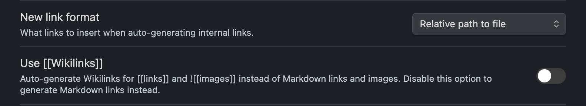

## 實作動機

工程師技術學不完，所以相信每個工程師都有不同的記錄方法，以我自己來說就是使用 Obsidian 做筆記，不定期的將所學內容更新到個人部落格上，一直以來我都是手動做這事，直到最近看了一篇[文章](https://alex-flow-state.netlify.app/pkm/obs-docusau-cowork#%E7%B7%A3%E7%94%B1)，開始回想自己每次發表新的文章要經過的步驟：

1. 打開 obsidian 並複製要發布文章
2. 打開 docusarus 專案，在 /docs 內新增對應的 `.md` 
3. 把該文章的圖片手動複製到 docusarus 專案內的 `/static/` 路徑下
4. 修改 obsidian 專屬的連結用法 `[[]]` 、修改圖片連結 `` ，手動調整成 docusarus 支援的格式
5. 手動調整文章新增 docusaurus 支援文章資訊格式

```
---
title: xxx
describition: sdad123xfad01 ...
---
```

6. 執行部署新增此次變更

像是 **這種重複性很高的事情**，工程師的我還不寫程式自動化？ **我的目標是流程全自動化**。


## 可透過 Obsidian 解決的部分

### 1.直接將 Docusaurus 專案設為 Obsidian 筆記的 valut 

維持以 Obsidian 筆記方式，你直接將技術筆記、想法寫在部落格專案中，**省去後續在筆記軟體（例如 Obsidian） 內容搬遷步驟。** 

實現概念就是：

```
在 Obsidian 管控文章內容（包括是否發布）
```

為了維持本來寫筆記跟歸類的方式與習慣，我額外調整了專案打包設定：


本來預設 Docusarus 的專案文章打包架構

```js
| - docs //打包、呈現這個架構下的 .md 內容
```

調整後的文章架構，但是我只要打包 `/published` 下的文章內容

```js
| - docs
	- published //要發布上部落格的文章內容，可以需求再開子層資料夾
	- drafts //靈感、想到想研究的事情
	- notes //以卡片盒整理的筆記，但是還沒要發布
	- resource //我有興趣的外部資源存放處
```

所以調整了 Docusaurus 的打包配置

```js
//docusaurus.config.js
docs: {
	path: "docs/published", // 只打包 published 資料夾
},
```

這樣能維持本來寫筆記的方式與習慣，一樣用 Obsidian 記錄筆記，當你的內容完成時，能直接透過 Obsidian 將文章移動到 `/published` 資料夾下，就能確保它會被成功打包。

### 2.解決筆記圖片問題

這邊有兩個問題要解決：

- 在每次發布新文章時，筆記內的圖片檔案（如截圖）都要手動搬移
- 圖片連結格式如何調整


首先，還記得現在部落格本身就是 valut 吧，所以可以透過 Obsidian 調整所有圖片存放預設路徑為存放 `/static` 內，符合 Docusarus 的打包設定，這樣就不再需要手動搬遷文章所需圖片。


接著要處理的是圖片名稱格式問題，當你想將文章相關截圖直接貼上時，你會得到的圖片名稱格式是

你存入的檔案名稱是

```
Pasted image 20250515154026.png
```

但是貼在筆記上的則是，因為它會幫你自動處理空格部分，這部分是問題之一

```
Pasted%image%20250515154026.png
```

這個問題我後來借用了  Paste Image Rename 套件解決


但是即便是如此，它仍然無法直接讀取，因為是超簡單實現，所以這邊我選擇以手動加上 `/` 在路徑上


### 3.調整筆記超連結設定

在 Obsidian 可以透過 `[[]]`  快速連結不同篇的文章，但是 Docusaurus 預設無法編譯這個連結格式，它支援的常見的 markdown 格式（如下）。

```
[linkName](path)
```


我們可透過設定調整 Obsidian 超連結格式設定：

1. 關閉 Wikilinks 的選項
2. 選擇相對路徑模式




## 實現自動化部署的部分

我的部落格是部署於 Github Page 上，Github 有提供 CICD 的功能，只需在專案新增 `.github/workflow` **設定指定觸發行為跟要執行內容**。

這邊我設定很單純的執行：

> 當 main 分支有新的變更時，執行專案部署指令  [CI 原始碼參考](https://github.com/southAndy/note/blob/main/.github/workflows/deploy.yml)

這樣就只剩下自動備份以及執行打包、部署指令的部分了，這部分我透過 Obsidian plugins Git 來實現，它可以設定定時把變更推上，搭配上述的 CICD 功能，就能完成自動備份、部署功能。


----
## 小結、目前的限制跟缺陷

- 會讓許多未上傳筆記的圖片一同被打包上傳
- 沒辦法針對不同文章客製化調整 git commit 內容
- 產生的 `.obsidian` 配置內容可以根據自己考量決定要不要上傳，我是覺得沒差所以有上傳
- 如果你要客製化側邊欄位的內容，還是需要手動進到專案調整側邊欄的 `.js` 檔案
- 因為所有筆記的圖片都存放在 `/static` 下，隨著筆記數量增加，後續維護會比較困難。
- 如果 Docusaurus 後續版本調整了設定，這套可能就不管用了。

